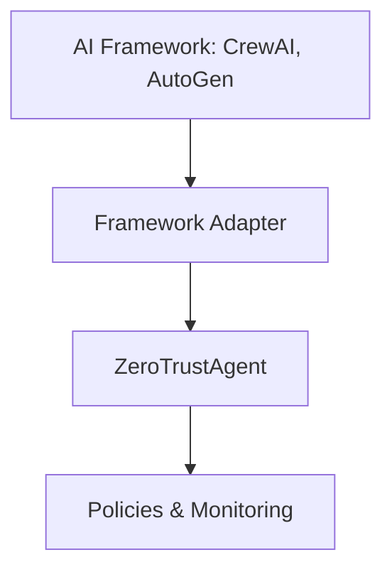
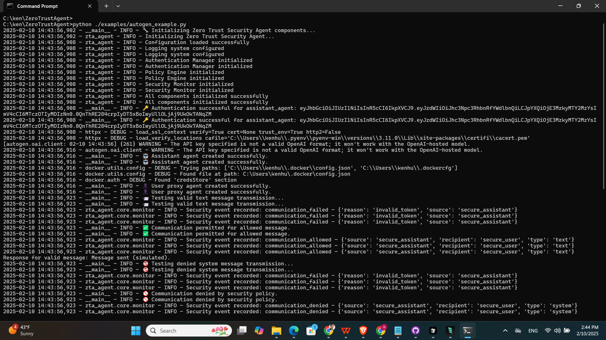

[](https://deepwiki.com/kenhuangus/ZeroTrustAgent)

# Zero Trust Agent (ZTA) Framework for Multi-Agent Collaboration

**`zta-agent`** is a Python package designed to implement a Zero Trust security framework for multi-agent systems. It addresses the critical need for secure and controlled interactions in environments where multiple autonomous agents collaborate. This is particularly relevant for systems built using frameworks like CrewAI and AutoGen.


## Why is Zero Trust Crucial for Multi-Agent Systems?

In multi-agent systems, traditional security models that rely on implicit trust are insufficient. A single compromised or malicious agent can jeopardize the entire system. Zero Trust architecture provides a robust solution by:

*   **Assuming No Implicit Trust:** Every agent interaction is treated as potentially hostile.
*   **Continuous Verification:** Authentication and authorization are required for each request.
*   **Least Privilege Principle:** Agents are granted only the necessary permissions.
*   **Microsegmentation:** Limits the blast radius of security breaches.
*   **Comprehensive Monitoring:** Tracks all agent activity for suspicious behavior.

## Project Description

`zta-agent` provides:

*   **Authentication:** Securely verifies agent identities. (currently a place holder, future improvement including allow integration with EntraID or social login or certificate based authentication)
*   **Fine-Grained Policy Enforcement:** Controls agent actions based on predefined policies.
*   **Comprehensive Security Monitoring:** Tracks and audits all security-relevant events.

This enables developers to build secure, reliable, and auditable multi-agent systems.

## How Developers Can Contribute

The `zta-agent` project welcomes contributions from AI engineers and framework developers to enhance its capabilities and integrations.

1.  **Framework Adapters:** Developers can create adapters for new AI frameworks, enabling seamless integration with the ZTA framework. This involves implementing security validation hooks and comprehensive monitoring.
2.  **Code Examples:** Contributions of code examples that demonstrate how to integrate core ZTA frameworks with various agentic frameworks are highly encouraged.

## ZTA Architecture

The ZTA architecture consists of:

1.  **Framework Adapters**: Interface between AI frameworks and security components
2.  **Core Zero Trust Agents**: Handle authentication, authorization, and policy enforcement
3.  **Policy Engine**: Evaluates security policies against agent actions
4.  **Security Monitor**: Tracks and audits all security-relevant events



## Installation & Setup

```bash
git clone https://github.com/kenhuangus/ZeroTrustAgent.git
cd ZeroTrustAgent
pip install build
python -m build
pip install -e .


```

### Basic Configuration

1.  **Environment Setup**

    ```bash
    cp .env.example .env
    ```

2.  **Configure your API keys in `.env`**:

    ```
    TOGETHER_API_KEY=your_api_key_here  # For LLM support
    OPENAI_API_KEY=your_api_key_here    # Optional, for OpenAI integration
    ```

3.  **Create your policy configuration in `config/policy.yaml`**:

    ```yaml
    auth:
      token_expiry: 3600
      secret_key: "your-secret-key-here"

    policies:
      policies:
        - name: "allow_research_agents"
          conditions:
            agent_id: {"regex": "^research_.*"}
            action_type: {"in": ["execute_task", "research"]}
          effect: "allow"
          priority: 90
    ```
4. **Sample test crewai integration with Zero Truse agent**


```bash

python ./examples/crewai_example.py

```
The following is the sample output

   


## Framework Integration Guide

### For AI Engineers & Framework Developers

1.  **Core Components** (`zta_agent/core/`):

    *   `AuthenticationManager`: Handles agent identity and token management
    *   `PolicyEngine`: Evaluates security policies
    *   `SecurityMonitor`: Tracks and audits agent activities

2.  **Integration Process**:

    *   Create new adapter in `zta_agent/integrations/`
    *   Implement security validation hooks
    *   Add comprehensive monitoring
    *   Follow existing patterns (see CrewAI/AutoGen examples)

3.  **Security Best Practices**:

    *   Follow Zero Trust principles
    *   Implement proper token validation
    *   Add detailed security event logging
    *   Follow policy enforcement patterns

### Example Framework Integration

Here's how to integrate a new AI framework with ZTA:

```python
from typing import Dict, Optional
from ..core.auth import AuthenticationManager
from ..core.policy import PolicyEngine
from ..core.monitor import SecurityMonitor

class NewFrameworkAdapter:
    def __init__(self, auth_manager: AuthenticationManager,
                 policy_engine: PolicyEngine,
                 security_monitor: SecurityMonitor):
        self.auth_manager = auth_manager
        self.policy_engine = policy_engine
        self.security_monitor = security_monitor

    def validate_agent_action(self, agent_id: str, action: Dict, token: str) -> bool:
        """Validate if an agent can perform a specific action."""
        # 1. Validate authentication token
        claims = self.auth_manager.validate_token(token)
        if not claims:
            self.security_monitor.record_event(
                "unauthorized_access",
                {"agent_id": agent_id, "action": action},
                "WARNING"
            )
            return False

        # 2. Create security context
        context = {
            "agent_id": agent_id,
            "action_type": action.get("type"),
            "resource": action.get("resource"),
            "claims": claims,
            "framework": "your_framework_name"
        }

        # 3. Evaluate against policies
        is_allowed = self.policy_engine.evaluate(context)

        # 4. Log the event
        self.security_monitor.record_event(
            "action_validation",
            {"context": context, "allowed": is_allowed},
            "INFO"
        )

        return is_allowed
```

## Authentication System

The Zero Trust Agent implements a robust authentication system with the following features:

### Documentation

* Authentication providers and configuration: `docs/authentication.md`
* Roadmap and maturity signals: `docs/roadmap.md`
* End-to-end Google OAuth example: `examples/google_oauth_end_to_end.py`

### Core Authentication Features

1. **Secure Token Management**
   - JWT-based authentication with access and refresh tokens
   - Configurable token expiry for both access and refresh tokens
   - Token revocation and blacklisting support
   - Automatic cleanup of expired tokens

2. **Password Security**
   - Secure password hashing using bcrypt
   - Configurable password policies:
     - Minimum length requirements
     - Character complexity rules (uppercase, lowercase, numbers, special)
     - Password expiration
     - Password history to prevent reuse
   - Account lockout after multiple failed attempts

3. **Security Logging**
   - Comprehensive security event logging
   - Authentication attempts tracking
   - Password changes and token operations
   - IP address and user agent tracking

### Configuration

Configure the authentication system in your `config/policy.yaml`:

```yaml
auth:
  secret_key: "your-secure-secret-key"
  token_expiry: 3600  # 1 hour
  refresh_token_expiry: 604800  # 7 days
  max_failed_attempts: 5
  lockout_duration: 300  # 5 minutes
  password_policy:
    min_length: 12
    require_uppercase: true
    require_lowercase: true
    require_numbers: true
    require_special: true
    max_age_days: 90
    history_size: 5
```

### Usage Example

```python
from zta_agent.core.auth import AuthenticationManager

# Initialize authentication manager
auth_manager = AuthenticationManager(config)

# Create new credentials
success, error = auth_manager.create_credentials(
    identity="agent1",
    password="SecurePassword123!"
)

# Authenticate and get tokens
tokens = auth_manager.authenticate({
    "identity": "agent1",
    "secret": "SecurePassword123!",
    "ip_address": "192.168.1.1",
    "user_agent": "Python/3.9"
})

if tokens:
    access_token = tokens["access_token"]
    refresh_token = tokens["refresh_token"]

# Validate a token
claims = auth_manager.validate_token(access_token)

# Refresh an access token
new_tokens = auth_manager.refresh_access_token(refresh_token)

# Change password
success, error = auth_manager.change_password(
    identity="agent1",
    old_password="SecurePassword123!",
    new_password="NewSecurePassword456!"
)

# Revoke tokens
auth_manager.revoke_token(access_token)
auth_manager.revoke_all_user_tokens("agent1")

## Authentication Providers

The Zero Trust Agent supports multiple authentication methods:

### 1. Password-based Authentication

The default authentication method using username/password credentials:

```python
auth_result = auth_manager.authenticate({
    "provider": "password",
    "identity": "agent1",
    "secret": "SecurePassword123!",
    "ip_address": "192.168.1.1",
    "user_agent": "Python/3.9"
})
```

### 2. OAuth Authentication

Support for OAuth 2.0 providers (e.g., Microsoft Entra ID, Google, GitHub):

```yaml
# Configuration in config/policy.yaml
auth:
  oauth:
    client_id: "your-client-id"
    client_secret: "your-client-secret"
    authorize_url: "https://login.microsoftonline.com/tenant-id/oauth2/v2.0/authorize"
    token_url: "https://login.microsoftonline.com/tenant-id/oauth2/v2.0/token"
    userinfo_url: "https://graph.microsoft.com/v1.0/me"
    redirect_uri: "http://localhost:8000/callback"
    scope: "openid profile email"
```

Usage example:

```python
# Step 1: Get authorization URL
oauth_provider = auth_manager.auth_providers["oauth"]
state = secrets.token_hex(16)
auth_url = oauth_provider.get_authorization_url(state)

# Step 2: After user authorization, authenticate with code
auth_result = auth_manager.authenticate({
    "provider": "oauth",
    "code": "authorization_code_from_callback",
    "ip_address": "192.168.1.1",
    "user_agent": "Python/3.9"
})

# Or authenticate with existing access token
auth_result = auth_manager.authenticate({
    "provider": "oauth",
    "access_token": "existing_oauth_token",
    "ip_address": "192.168.1.1",
    "user_agent": "Python/3.9"
})
```

### 3. Certificate-based Authentication

Support for client certificate authentication:

```yaml
# Configuration in config/policy.yaml
auth:
  certificate:
    ca_cert_path: "/path/to/ca.crt"
    verify_crl: true
    crl_path: "/path/to/crl.pem"
    allowed_subjects:
      - "O=YourOrg"
      - "OU=Agents"
```

Usage example:

```python
# Read client certificate
with open("client.crt", "rb") as f:
    cert_data = f.read()

# Authenticate with certificate
auth_result = auth_manager.authenticate({
    "provider": "certificate",
    "certificate": cert_data,
    "ip_address": "192.168.1.1",
    "user_agent": "Python/3.9"
})
```

### Social Login Providers

The Zero Trust Agent supports popular social and enterprise login providers:

#### Google OAuth

```yaml
# Configuration in config/policy.yaml
auth:
  google:
    client_id: "your-google-client-id"
    client_secret: "your-google-client-secret"
    redirect_uri: "http://localhost:8000/auth/google/callback"
    scope: "openid email profile"  # Optional, this is the default
```

Usage example:

```python
# Get Google authorization URL
google_provider = auth_manager.auth_providers["google"]
state = secrets.token_hex(16)
auth_url = google_provider.get_authorization_url(state)

# After user authorization, authenticate with code
auth_result = auth_manager.authenticate({
    "provider": "google",
    "code": "google_auth_code",
    "ip_address": "192.168.1.1",
    "user_agent": "Python/3.9"
})
```

#### GitHub OAuth

```yaml
# Configuration in config/policy.yaml
auth:
  github:
    client_id: "your-github-client-id"
    client_secret: "your-github-client-secret"
    redirect_uri: "http://localhost:8000/auth/github/callback"
    scope: "read:user user:email"  # Optional, this is the default
```

Usage example:

```python
# Get GitHub authorization URL
github_provider = auth_manager.auth_providers["github"]
state = secrets.token_hex(16)
auth_url = github_provider.get_authorization_url(state)

# After user authorization, authenticate with code
auth_result = auth_manager.authenticate({
    "provider": "github",
    "code": "github_auth_code",
    "ip_address": "192.168.1.1",
    "user_agent": "Python/3.9"
})
```

#### Microsoft Entra ID (Azure AD)

```yaml
# Configuration in config/policy.yaml
auth:
  entra:
    client_id: "your-app-client-id"
    client_secret: "your-client-secret"
    tenant_id: "your-tenant-id"
    redirect_uri: "http://localhost:8000/auth/entra/callback"
    scope: "openid email profile User.Read"  # Optional, this is the default
```

Usage example:

```python
# Get Microsoft authorization URL
entra_provider = auth_manager.auth_providers["entra"]
state = secrets.token_hex(16)
auth_url = entra_provider.get_authorization_url(state)

# After user authorization, authenticate with code
auth_result = auth_manager.authenticate({
    "provider": "entra",
    "code": "entra_auth_code",
    "ip_address": "192.168.1.1",
    "user_agent": "Python/3.9"
})
```

### Provider-specific Response Data

Each social provider returns additional user information:

1. **Google**:
   ```python
   {
       "identity": "google-user-id",
       "email": "user@gmail.com",
       "name": "User Name",
       "picture": "https://...",
       "email_verified": true,
       "locale": "en",
       "provider": "google"
   }
   ```

2. **GitHub**:
   ```python
   {
       "identity": "github-user-id",
       "email": "user@github.com",
       "name": "User Name",
       "login": "username",
       "avatar_url": "https://...",
       "html_url": "https://github.com/username",
       "company": "Company Name",
       "location": "Location",
       "email_verified": true,
       "provider": "github"
   }
   ```

3. **Microsoft Entra ID**:
   ```python
   {
       "identity": "entra-user-id",
       "email": "user@company.com",
       "name": "User Name",
       "given_name": "Given",
       "surname": "Name",
       "job_title": "Job Title",
       "business_phones": ["+1..."],
       "office_location": "Office",
       "preferred_language": "en-US",
       "photo": "binary-photo-data",
       "provider": "entra"
   }
   ```

### Social Login Security Best Practices

1. **Configuration Security**
   - Store client secrets securely using environment variables or secret management systems
   - Use separate OAuth applications for development and production
   - Regularly rotate client secrets

2. **State Management**
   - Always validate the state parameter to prevent CSRF attacks
   - Use cryptographically secure random values for state
   - Implement session management to track state across requests

3. **Scope Management**
   - Request minimal scopes needed for your application
   - Document and review all requested scopes
   - Handle scope changes in provider configurations

4. **User Data Handling**
   - Validate email verification status when using email for identity
   - Handle provider-specific user data formats
   - Implement user data synchronization policies

5. **Error Handling**
   - Handle provider-specific error responses
   - Implement proper error logging and monitoring
   - Provide user-friendly error messages

### Authentication Response

All authentication methods return a consistent response format:

```python
{
    "access_token": "jwt_access_token",
    "refresh_token": "jwt_refresh_token",
    "token_type": "bearer",
    "expires_in": 3600,
    "identity": "user_or_agent_id",
    "provider": "password|oauth|certificate",
    # Additional provider-specific information
}
```

### Security Best Practices

1. **OAuth Security**
   - Use HTTPS for all OAuth endpoints
   - Validate state parameter to prevent CSRF
   - Store client secrets securely
   - Use appropriate scopes

2. **Certificate Security**
   - Keep CA private key secure
   - Regularly update CRL
   - Use strong certificate policies
   - Implement certificate rotation

3. **General Security**
   - Monitor authentication attempts
   - Implement rate limiting
   - Use secure communication channels
   - Regular security audits

## API Documentation

### Authentication Manager

```python
auth_manager.authenticate(credentials: Dict) -> str
auth_manager.validate_token(token: str) -> Optional[Dict]
auth_manager.revoke_token(token: str) -> bool
```

### Policy Engine

```python
policy_engine.evaluate(context: Dict) -> bool
policy_engine.add_policy(policy: Policy) -> None
policy_engine.remove_policy(policy_name: str) -> bool
```

### Security Monitor

```python
security_monitor.record_event(event_type: str, details: Dict, severity: str) -> None
security_monitor.get_events(event_type: str = None, severity: str = None) -> List[SecurityEvent]
security_monitor.get_alerts(severity: str = None) -> List[SecurityEvent]
```

## Advanced Security Monitoring

The Zero Trust Agent includes a sophisticated security monitoring system with advanced threat detection and behavioral analytics capabilities:

### Behavioral Analytics

1. **User Behavior Profiling**
   - Machine learning-based anomaly detection
   - Access pattern analysis
   - Device fingerprinting
   - Location-based tracking
   - Resource usage monitoring
   - Session behavior analysis

2. **Network Behavior Analysis**
   - Protocol anomaly detection
   - Bandwidth pattern monitoring
   - Connection tracking
   - Flow analysis
   - Peer IP profiling
   - Packet size analysis

3. **ML-Powered Detection**
   - Isolation Forest for anomaly detection
   - Sequential pattern analysis using LSTM
   - Real-time risk scoring
   - Automated profile updates
   - Confidence-based alerting

### Threat Hunting & Intelligence

1. **MITRE ATT&CK Integration**
   - Comprehensive technique coverage
   - Tactic mapping
   - Detection strategies
   - Mitigation recommendations
   - Data source correlation

2. **Detection Rules**
   - YARA rule support
   - Sigma rule integration
   - Custom rule engine
   - Real-time rule updates
   - Pattern matching

3. **Threat Intelligence**
   - Multiple feed integration (AlienVault, MISP)
   - IOC management
   - Threat scoring
   - Automated correlation
   - Historical analysis

### LLM-Based Security Analysis

1. **Multi-Provider Support**
   - OpenAI GPT-4 integration
   - Anthropic Claude support
   - Google Vertex AI compatibility
   - Automatic provider failover
   - Configurable model selection

2. **Intelligent Analysis**
   - Context-aware threat assessment
   - Natural language reasoning
   - Pattern recognition
   - False positive reduction
   - Automated response recommendations

3. **Security Response**
   - Automated threat mitigation
   - Confidence-based actions
   - Customizable response rules
   - Admin notifications
   - Incident documentation

### Configuration Example

```yaml
# Security monitoring configuration
monitoring:
  # Behavioral Analytics
  behavioral_analytics:
    model_path: "models/"
    training_interval: 86400  # 24 hours
    risk_weights:
      anomaly: 0.4
      sequence: 0.3
      profile: 0.3

  # Threat Hunting
  threat_hunting:
    mitre:
      cache_file: "cache/mitre_attack.json"
      minimum_confidence: 0.7
    rules:
      yara_rules_path: "rules/yara/"
      sigma_rules_path: "rules/sigma/"

  # LLM Analysis
  llm:
    provider: "openai"  # Primary provider
    model: "gpt-4"
    backup_providers:
      - "anthropic"
      - "vertex"
```

### Usage Example

```python
from zta_agent.core.security_analysis import SecurityMonitor, BehavioralAnalytics, ThreatHunter

# Initialize security components
security_monitor = SecurityMonitor(config)
behavioral_analytics = BehavioralAnalytics(config)
threat_hunter = ThreatHunter(config)

# Monitor security events
security_monitor.record_event(
    event_type="authentication_attempt",
    details={
        "user_id": "user123",
        "ip_address": "192.168.1.100",
        "location": "US-NYC",
        "device": "Windows-Chrome"
    },
    severity="info"
)

# Analyze user behavior
risk_score, anomalies = behavioral_analytics.analyze_user_behavior(
    user_id="user123",
    event_data={
        "timestamp": "2025-02-20T23:30:00",
        "action": "resource_access",
        "resource": "/api/sensitive_data"
    }
)

# Hunt for threats
threats = threat_hunter.hunt_threats(event_data={
    "source_ip": "192.168.1.100",
    "destination_ip": "203.0.113.1",
    "protocol": "HTTPS",
    "payload_size": 1500
})
```


## Integration Examples

### CrewAI Integration

The Zero Trust Security Agent system now simulates two agents:
- **Allowed Agent**: For example, an agent with identity `research_agent` that meets the policy conditions (matches the regex `^research_.*`).
- **Denied Agent**: For example, an agent with identity `denied_agent` that does not meet any allow conditions and falls to the default deny.

When you run the example below, only the allowed agent will proceed with task execution while the denied agent's execution is halted.

```python
from zta_agent import initialize_agent
from crewai import Agent, Task, Crew
from zta_agent.integrations.crewai_adapter import CrewAIAdapter

# Initialize ZTA components
zta_components = initialize_agent()
crewai_adapter = zta_components['crewai_adapter']
auth_manager = zta_components['auth_manager']

# Authenticate allowed and denied agents
allowed_token = auth_manager.authenticate({
    "identity": "research_agent",
    "secret": "research_secret"
})
denied_token = auth_manager.authenticate({
    "identity": "denied_agent",
    "secret": "denied_secret"
})

# Validate actions for each agent
allowed_decision = crewai_adapter.validate_agent_action("research_agent",
    {"type": "execute_task", "resource": "operation"}, allowed_token)
denied_decision = crewai_adapter.validate_agent_action("denied_agent",
    {"type": "execute_task", "resource": "operation"}, denied_token)

if allowed_decision:
    print("Allowed agent: execution permitted.")
else:
    print("Allowed agent: execution denied.")

if denied_decision:
    print("Denied agent: execution permitted.")
else:
    print("Denied agent: execution denied. Halting further execution.")

# Create tasks only for the allowed agent.
if allowed_decision:
    # Replace with your actual agent creation logic
    agent = Agent(role='Researcher', goal='Research', backstory='...', allow_delegation=False)
    task = Task(
        description="Research AI security patterns",
        agent=agent
    )
    crew = Crew(
        agents=[agent],
        tasks=[task]
    )
    result = crew.kickoff()
    print("Crew execution result:", result)
```

### AutoGen Integration

```python
from zta_agent import initialize_agent

# Initialize components
zta_components = initialize_agent()
autogen_adapter = zta_components['autogen_adapter']
auth_manager = zta_components['auth_manager']

# Authenticate agent
token = auth_manager.authenticate({
    "identity": "test_agent",
    "secret": "test_secret"
})

# Validate agent communication
result = autogen_adapter.validate_agent_communication(
    source_agent="assistant",
    target_agent="user",
    message={"type": "text", "content": "Hello"},
    token=token
)
```

### OpenAI Agents SDK Integration

The Zero Trust Agent now includes comprehensive support for the OpenAI Agents Python SDK, providing security validation for all agent operations.

```python
from zta_agent import initialize_agent
from zta_agent.integrations.openai_agent_adapter import OpenAIAgentAdapter

# Initialize ZTA components
zta_components = initialize_agent()
openai_adapter = zta_components['openai_agent_adapter']
auth_manager = zta_components['auth_manager']

# Authenticate agent
auth_result = auth_manager.authenticate({
    "identity": "research_assistant",
    "secret": "secure_password",
    "ip_address": "127.0.0.1",
    "user_agent": "OpenAI-Agent/1.0"
})
token = auth_result["access_token"]

# Secure agent creation
agent_config = {
    "name": "ResearchAssistant", 
    "instructions": "You are a research assistant",
    "tools": [weather_tool, search_tool]
}

if openai_adapter.validate_agent_creation(agent_config, token):
    # Create OpenAI agent
    from agents import Agent
    agent = Agent(**agent_config)
    print("✅ Agent created with zero trust validation")

# Secure tool execution
secure_weather = openai_adapter.create_secure_function_tool(weather_tool, token)
result = secure_weather(location="San Francisco", agent_id="research_assistant")

# Secure runner execution with input validation
validation_result = openai_adapter.secure_runner_execution(
    agent_config=agent_config,
    user_input="What's the weather in NYC?",
    token=token
)

if validation_result["allowed"]:
    from agents import Runner
    result = Runner.run_sync(agent, validation_result["user_input"])
```

**Key Security Features for OpenAI Agents:**

- **Agent Creation Validation**: Validates agent configurations and creator permissions
- **Tool Execution Security**: Validates function calls and detects malicious arguments
- **Input Sanitization**: Comprehensive validation of user inputs to prevent injection attacks
- **Agent Handoff Control**: Validates agent-to-agent communication and control transfers
- **Session Management**: Secure session creation, updates, and destruction
- **Guardrail Integration**: Security validation for OpenAI guardrail operations
- **Comprehensive Monitoring**: Detailed logging of all agent operations and security events

For detailed documentation, see [OpenAI Agents Integration Guide](docs/openai_agents_integration.md).

## Security Considerations

**API Key Management**:

*   Store API keys securely in environment variables.
*   Never commit API keys to version control.
*   Rotate keys regularly.

**Policy Configuration**:

*   Start with restrictive policies.
*   Use the principle of least privilege.
*   Regularly audit policy configurations.

**Monitoring**:

*   Enable logging for all security events.
*   Set up alerts for suspicious activities.
*   Regularly review security logs.

