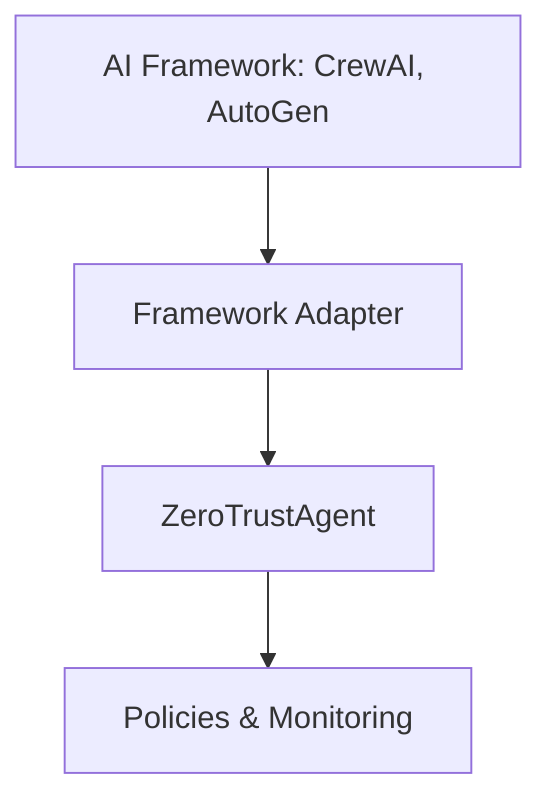

# Zero Trust Agent (ZTA) Framework for Multi-Agent Collaboration

**`zta-agent`** is a Python package designed to implement a Zero Trust security framework for multi-agent systems. It addresses the critical need for secure and controlled interactions in environments where multiple autonomous agents collaborate. This is particularly relevant for systems built using frameworks like CrewAI and AutoGen.

## Why is Zero Trust Crucial for Multi-Agent Systems?

In multi-agent systems, traditional security models that rely on implicit trust are insufficient. A single compromised or malicious agent can jeopardize the entire system. Zero Trust architecture provides a robust solution by:

*   **Assuming No Implicit Trust:** Every agent interaction is treated as potentially hostile.
*   **Continuous Verification:** Authentication and authorization are required for each request.
*   **Least Privilege Principle:** Agents are granted only the necessary permissions.
*   **Microsegmentation:** Limits the blast radius of security breaches.
*   **Comprehensive Monitoring:** Tracks all agent activity for suspicious behavior.

## Project Description

`zta-agent` provides:

*   **Robust Authentication:** Securely verifies agent identities.
*   **Fine-Grained Policy Enforcement:** Controls agent actions based on predefined policies.
*   **Comprehensive Security Monitoring:** Tracks and audits all security-relevant events.

This enables developers to build secure, reliable, and auditable multi-agent systems.

## How Developers Can Contribute

The `zta-agent` project welcomes contributions from AI engineers and framework developers to enhance its capabilities and integrations.

1.  **Framework Adapters:** Developers can create adapters for new AI frameworks, enabling seamless integration with the ZTA framework. This involves implementing security validation hooks and comprehensive monitoring.
2.  **Code Examples:** Contributions of code examples that demonstrate how to integrate core ZTA frameworks with various agentic frameworks are highly encouraged.

## ZTA Architecture

The ZTA architecture consists of:

1.  **Framework Adapters**: Interface between AI frameworks and security components
2.  **Core Zero Trust Agents**: Handle authentication, authorization, and policy enforcement
3.  **Policy Engine**: Evaluates security policies against agent actions
4.  **Security Monitor**: Tracks and audits all security-relevant events



## Installation & Setup

```bash
git clone https://github.com/kenhuangus/ZeroTrustAgent.git
cd ZeroTrustAgent
pip install build
python -m build
pip install -e .


```

### Basic Configuration

1.  **Environment Setup**

    ```bash
    cp .env.example .env
    ```

2.  **Configure your API keys in `.env`**:

    ```
    TOGETHER_API_KEY=your_api_key_here  # For LLM support
    OPENAI_API_KEY=your_api_key_here    # Optional, for OpenAI integration
    ```

3.  **Create your policy configuration in `config/policy.yaml`**:

    ```yaml
    auth:
      token_expiry: 3600
      secret_key: "your-secret-key-here"

    policies:
      policies:
        - name: "allow_research_agents"
          conditions:
            agent_id: {"regex": "^research_.*"}
            action_type: {"in": ["execute_task", "research"]}
          effect: "allow"
          priority: 90
    ```
4. **Sample test crewai integration with Zero Truse agent**

```bash
python ./examples/test_crewai.py
```

## Framework Integration Guide

### For AI Engineers & Framework Developers

1.  **Core Components** (`zta_agent/core/`):

    *   `AuthenticationManager`: Handles agent identity and token management
    *   `PolicyEngine`: Evaluates security policies
    *   `SecurityMonitor`: Tracks and audits agent activities

2.  **Integration Process**:

    *   Create new adapter in `zta_agent/integrations/`
    *   Implement security validation hooks
    *   Add comprehensive monitoring
    *   Follow existing patterns (see CrewAI/AutoGen examples)

3.  **Security Best Practices**:

    *   Follow Zero Trust principles
    *   Implement proper token validation
    *   Add detailed security event logging
    *   Follow policy enforcement patterns

### Example Framework Integration

Here's how to integrate a new AI framework with ZTA:

```python
from typing import Dict, Optional
from ..core.auth import AuthenticationManager
from ..core.policy import PolicyEngine
from ..core.monitor import SecurityMonitor

class NewFrameworkAdapter:
    def __init__(self, auth_manager: AuthenticationManager,
                 policy_engine: PolicyEngine,
                 security_monitor: SecurityMonitor):
        self.auth_manager = auth_manager
        self.policy_engine = policy_engine
        self.security_monitor = security_monitor

    def validate_agent_action(self, agent_id: str, action: Dict, token: str) -> bool:
        """Validate if an agent can perform a specific action."""
        # 1. Validate authentication token
        claims = self.auth_manager.validate_token(token)
        if not claims:
            self.security_monitor.record_event(
                "unauthorized_access",
                {"agent_id": agent_id, "action": action},
                "WARNING"
            )
            return False

        # 2. Create security context
        context = {
            "agent_id": agent_id,
            "action_type": action.get("type"),
            "resource": action.get("resource"),
            "claims": claims,
            "framework": "your_framework_name"
        }

        # 3. Evaluate against policies
        is_allowed = self.policy_engine.evaluate(context)

        # 4. Log the event
        self.security_monitor.record_event(
            "action_validation",
            {"context": context, "allowed": is_allowed},
            "INFO"
        )

        return is_allowed
```

## Integration Examples

### CrewAI Integration

```python
from zta_agent import initialize_agent
from crewai import Agent, Task, Crew, Process  # Import Process

# Initialize ZTA components
zta_components = initialize_agent()
crewai_adapter = zta_components['crewai_adapter']
auth_manager = zta_components['auth_manager']

# Authenticate agent
token = auth_manager.authenticate({
    "identity": "research_agent",
    "secret": "your_secret"
})

# Create secure agent (assuming create_secure_agent is defined or accessible)
# Replace with your actual agent creation logic if needed
agent = Agent(role='Researcher', goal='Research', backstories='...', allow_delegation=False)  # Example

# Create and execute tasks with security validation
task = Task(
    description="Research AI security patterns",
    agent=agent
)

crew = Crew(
    agents=[agent],
    tasks=[task],
    process=Process.sequential #Add process
)

# Execute with security checks
result = crew.kickoff()
```

### AutoGen Integration

```python
from zta_agent import initialize_agent

# Initialize components
zta_components = initialize_agent()
autogen_adapter = zta_components['autogen_adapter']
auth_manager = zta_components['auth_manager']

# Authenticate agent
token = auth_manager.authenticate({
    "identity": "test_agent",
    "secret": "test_secret"
})

# Validate agent communication
result = autogen_adapter.validate_agent_communication(
    source_agent="assistant",
    target_agent="user",
    message={"type": "text", "content": "Hello"},
    token=token
)
```

## Security Considerations

**API Key Management**:

*   Store API keys securely in environment variables.
*   Never commit API keys to version control.
*   Rotate keys regularly.

**Policy Configuration**:

*   Start with restrictive policies.
*   Use the principle of least privilege.
*   Regularly audit policy configurations.

**Monitoring**:

*   Enable logging for all security events.
*   Set up alerts for suspicious activities.
*   Regularly review security logs.

## API Documentation

### Authentication Manager

```python
auth_manager.authenticate(credentials: Dict) -> str
auth_manager.validate_token(token: str) -> Optional[Dict]
auth_manager.revoke_token(token: str) -> bool
```

### Policy Engine

```python
policy_engine.evaluate(context: Dict) -> bool
policy_engine.add_policy(policy: Policy) -> None
policy_engine.remove_policy(policy_name: str) -> bool
```

### Security Monitor

```python
security_monitor.record_event(event_type: str, details: Dict, severity: str) -> None
security_monitor.get_events(event_type: str = None, severity: str = None) -> List[SecurityEvent]
security_monitor.get_alerts(severity: str = None) -> List[SecurityEvent]
```

## License

This project is licensed under the MIT License - see the [LICENSE](LICENSE) file for details.
```

## Installation & Setup

```bash
pip install zta-agent
```

### Basic Configuration

1. Environment Setup
```bash
cp .env.example .env
```

2. Configure your API keys in `.env`:
```
TOGETHER_API_KEY=your_api_key_here  # For LLM support
OPENAI_API_KEY=your_api_key_here    # Optional, for OpenAI integration
```

3. Create your policy configuration in `config/policy.yaml`:
```yaml
auth:
  token_expiry: 3600
  secret_key: "your-secret-key-here"

policies:
  policies:
    - name: "allow_research_agents"
      conditions:
        agent_id: {"regex": "^research_.*"}
        action_type: {"in": ["execute_task", "research"]}
      effect: "allow"
      priority: 90
```

## Framework Integration Guide

### For AI Engineers & Framework Developers

1. **Core Components** (`zta_agent/core/`):
   - `AuthenticationManager`: Handles agent identity and token management
   - `PolicyEngine`: Evaluates security policies
   - `SecurityMonitor`: Tracks and audits agent activities

2. **Integration Process**:
   - Create new adapter in `zta_agent/integrations/`
   - Implement security validation hooks
   - Add comprehensive monitoring
   - Follow existing patterns (see CrewAI/AutoGen examples)

3. **Security Best Practices**:
   - Follow Zero Trust principles
   - Implement proper token validation
   - Add detailed security event logging
   - Follow policy enforcement patterns

### Example Framework Integration

Here's how to integrate a new AI framework with ZTA:

```python
from typing import Dict, Optional
from ..core.auth import AuthenticationManager
from ..core.policy import PolicyEngine
from ..core.monitor import SecurityMonitor

class NewFrameworkAdapter:
    def __init__(self, auth_manager: AuthenticationManager,
                 policy_engine: PolicyEngine,
                 security_monitor: SecurityMonitor):
        self.auth_manager = auth_manager
        self.policy_engine = policy_engine
        self.security_monitor = security_monitor

    def validate_agent_action(self, agent_id: str, action: Dict, token: str) -> bool:
        """Validate if an agent can perform a specific action."""
        # 1. Validate authentication token
        claims = self.auth_manager.validate_token(token)
        if not claims:
            self.security_monitor.record_event(
                "unauthorized_access",
                {"agent_id": agent_id, "action": action},
                "WARNING"
            )
            return False

        # 2. Create security context
        context = {
            "agent_id": agent_id,
            "action_type": action.get("type"),
            "resource": action.get("resource"),
            "claims": claims,
            "framework": "your_framework_name"
        }

        # 3. Evaluate against policies
        is_allowed = self.policy_engine.evaluate(context)

        # 4. Log the event
        self.security_monitor.record_event(
            "action_validation",
            {"context": context, "allowed": is_allowed},
            "INFO"
        )

        return is_allowed
```

### Integration Examples

#### CrewAI Integration
```python
from zta_agent import initialize_agent
from crewai import Agent, Task, Crew

# Initialize ZTA components
zta_components = initialize_agent()
crewai_adapter = zta_components['crewai_adapter']
auth_manager = zta_components['auth_manager']

# Authenticate agent
token = auth_manager.authenticate({
    "identity": "research_agent",
    "secret": "your_secret"
})

# Create secure agent
agent = create_secure_agent("research_agent", token)

# Create and execute tasks with security validation
task = Task(
    agent=agent,
    description="Research AI security patterns"
)

crew = Crew(
    agents=[agent],
    tasks=[task]
)

# Execute with security checks
result = crew.kickoff()
```

#### AutoGen Integration
```python
from zta_agent import initialize_agent

# Initialize components
zta_components = initialize_agent()
autogen_adapter = zta_components['autogen_adapter']

# Validate agent communication
result = autogen_adapter.validate_agent_communication(
    source_agent="assistant",
    target_agent="user",
    message={"type": "text", "content": "Hello"},
    token=token
)
