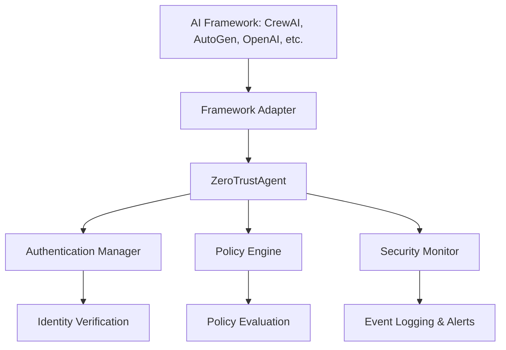

[](https://deepwiki.com/kenhuangus/ZeroTrustAgent)

# Zero Trust Agent (ZTA) Framework for Multi-Agent Collaboration

**`zta-agent`** is a Python package designed to implement a Zero Trust security framework for multi-agent systems. It addresses the critical need for secure and controlled interactions in environments where multiple autonomous agents collaborate. This is particularly relevant for systems built using popular AI frameworks like CrewAI, AutoGen, OpenAI Agents, LangGraph, and more.

## Why is Zero Trust Crucial for Multi-Agent Systems?

In multi-agent systems, traditional security models that rely on implicit trust are insufficient. A single compromised or malicious agent can jeopardize the entire system. Zero Trust architecture provides a robust solution by:

* **Assuming No Implicit Trust:** Every agent interaction is treated as potentially hostile.
* **Continuous Verification:** Authentication and authorization are required for each request.
* **Least Privilege Principle:** Agents are granted only the necessary permissions.
* **Microsegmentation:** Limits the blast radius of security breaches.
* **Comprehensive Monitoring:** Tracks all agent activity for suspicious behavior.

## Project Description

`zta-agent` provides:

* **Authentication:** Securely verifies agent identities with multiple provider support (password, OAuth, certificates, social login)
* **Fine-Grained Policy Enforcement:** Controls agent actions based on predefined policies.
* **Comprehensive Security Monitoring:** Tracks and audits all security-relevant events.
* **Framework Adapters:** Ready-to-use integrations with popular AI frameworks.

This enables developers to build secure, reliable, and auditable multi-agent systems.

## Supported Framework Adapters

The Zero Trust Agent currently supports the following AI frameworks:

| Framework | Adapter | Status | Example |
|-----------|---------|--------|---------|
| **CrewAI** | `CrewAIAdapter` | ✅ Stable | `examples/crewai_example.py` |
| **AutoGen** | `AutoGenAdapter` | ✅ Stable | `examples/autogen_example.py` |
| **OpenAI Agents** | `OpenAIAgentAdapter` | ✅ Stable | `examples/openai_agent_example.py` |
| **LangGraph** | `LangGraphAdapter` | ✅ Stable | `examples/langgraph_example.py` |
| **Google Agent SDK** | `GoogleAgentAdapter` | ✅ Stable | `examples/google_agent_example.py` |
| **Amazon Bedrock** | `BedrockAgentAdapter` | ✅ Stable | `examples/bedrock_agent_example.py` |
| **Anthropic Claude** | `ClaudeAgentAdapter` | ✅ Stable | `examples/claude_agent_example.py` |
| **IBM watsonx** | `IBMWatsonXAdapter` | ✅ Stable | `examples/ibm_watsonx_example.py` |

### Adapter Features

Each adapter provides:
- **Authentication Validation:** Verifies agent identities before allowing operations
- **Policy Enforcement:** Applies Zero Trust policies to all framework operations
- **Security Monitoring:** Logs all security events for auditing
- **Input Validation:** Sanitizes inputs to prevent injection attacks
- **Session Management:** Secure handling of agent sessions

## Installation & Setup

```bash
git clone https://github.com/kenhuangus/ZeroTrustAgent.git
cd ZeroTrustAgent
pip install build
python -m build
pip install -e .
```

### Basic Configuration

1. **Environment Setup**
```bash
cp .env.example .env
```

2. **Configure your API keys in `.env`:**
```
# Required for LLM support
TOGETHER_API_KEY=your_api_key_here

# Framework-specific API keys (optional, based on your needs)
OPENAI_API_KEY=your_openai_key_here
GOOGLE_API_KEY=your_google_key_here
ANTHROPIC_API_KEY=your_anthropic_key_here
AWS_ACCESS_KEY_ID=your_aws_key_id
AWS_SECRET_ACCESS_KEY=your_aws_secret
WATSONX_API_KEY=your_watsonx_key
WATSONX_PROJECT_ID=your_watsonx_project
```

3. **Create your policy configuration in `config/policy.yaml`:**
```yaml
auth:
  token_expiry: 3600
  secret_key: "your-secret-key-here"

policies:
  policies:
    - name: "allow_research_agents"
      conditions:
        agent_id: {"regex": "^research_.*"}
        action_type: {"in": ["execute_task", "research"]}
      effect: "allow"
      priority: 90
```

## Testing the Adapters

### Quick Test All Adapters

Run the test suite to verify all adapters are working:

```bash
# Run all tests
python -m pytest tests/ -v

# Run tests for specific adapters
python -m pytest tests/integrations/test_crewai_adapter.py -v
python -m pytest tests/integrations/test_autogen_adapter.py -v
python -m pytest tests/integrations/test_openai_agent_adapter.py -v
python -m pytest tests/integrations/test_langgraph_adapter.py -v
python -m pytest tests/integrations/test_google_agent_adapter.py -v
python -m pytest tests/integrations/test_bedrock_agent_adapter.py -v
python -m pytest tests/integrations/test_claude_agent_adapter.py -v
python -m pytest tests/integrations/test_ibm_watsonx_adapter.py -v
```

### Running Framework Examples

Each adapter includes a working example that demonstrates Zero Trust security integration:

#### 1. CrewAI Example
```bash
python examples/crewai_example.py
```
Demonstrates secure task execution with CrewAI agents.

#### 2. AutoGen Example
```bash
python examples/autogen_example.py
```
Shows secure agent communication in AutoGen conversations.

#### 3. OpenAI Agents Example
```bash
python examples/openai_agent_example.py
```
Demonstrates secure agent creation, tool execution, and runner validation.

#### 4. LangGraph Example
```bash
python examples/langgraph_example.py
```
Shows secure state graph execution with LangGraph (uses Ollama for local LLM).

#### 5. Google Agent SDK Example
```bash
python examples/google_agent_example.py
```
Demonstrates secure function calling, grounding, and chat sessions with Gemini.

#### 6. Amazon Bedrock Example
```bash
python examples/bedrock_agent_example.py
```
Shows secure agent aliases, knowledge base queries, and action groups.

#### 7. Anthropic Claude Example
```bash
python examples/claude_agent_example.py
```
Demonstrates secure tool use, computer use, and artifact creation.

#### 8. IBM watsonx Example
```bash
python examples/ibm_watsonx_example.py
```
Shows secure prompt templates, model inference, and agent orchestration.

### Example Output

Each example outputs:
- Security event logs to `{framework}_agent.log`
- Results to `{framework}_agent_output.json`
- Console summary of security validations

## ZTA Architecture

The ZTA architecture consists of:

1. **Framework Adapters**: Interface between AI frameworks and security components
2. **Core Zero Trust Agents**: Handle authentication, authorization, and policy enforcement
3. **Policy Engine**: Evaluates security policies against agent actions
4. **Security Monitor**: Tracks and audits all security-relevant events



## Framework Integration Guide

### For AI Engineers & Framework Developers

1. **Core Components** (`zta_agent/core/`):
   * `AuthenticationManager`: Handles agent identity and token management
   * `PolicyEngine`: Evaluates security policies
   * `SecurityMonitor`: Tracks and audits agent activities

2. **Integration Process**:
   * Create new adapter in `zta_agent/integrations/`
   * Implement security validation hooks
   * Add comprehensive monitoring
   * Follow existing patterns (see existing adapter examples)

3. **Security Best Practices**:
   * Follow Zero Trust principles
   * Implement proper token validation
   * Add detailed security event logging
   * Follow policy enforcement patterns

### Creating a New Adapter

Here's how to integrate a new AI framework with ZTA:

```python
from typing import Dict, Optional
from ..core.auth import AuthenticationManager
from ..core.policy import PolicyEngine
from ..core.monitor import SecurityMonitor

class NewFrameworkAdapter:
    def __init__(self, auth_manager: AuthenticationManager, 
                 policy_engine: PolicyEngine, 
                 security_monitor: SecurityMonitor):
        self.auth_manager = auth_manager
        self.policy_engine = policy_engine
        self.security_monitor = security_monitor
    
    def validate_agent_action(self, agent_id: str, action: Dict, token: str) -> bool:
        """Validate if an agent can perform a specific action."""
        # 1. Validate authentication token
        claims = self.auth_manager.validate_token(token)
        if not claims:
            self.security_monitor.record_event(
                "unauthorized_access",
                {"agent_id": agent_id, "action": action},
                "WARNING"
            )
            return False
        
        # 2. Create security context
        context = {
            "agent_id": agent_id,
            "action_type": action.get("type"),
            "resource": action.get("resource"),
            "claims": claims,
            "framework": "your_framework_name"
        }
        
        # 3. Evaluate against policies
        is_allowed = self.policy_engine.evaluate(context)
        
        # 4. Log the event
        self.security_monitor.record_event(
            "action_validation",
            {"context": context, "allowed": is_allowed},
            "INFO"
        )
        return is_allowed
```

## Authentication System

The Zero Trust Agent implements a robust authentication system with multiple provider support:

### Supported Authentication Methods

1. **Password-based Authentication** - Default username/password with bcrypt hashing
2. **OAuth 2.0** - Generic OAuth provider support
3. **Certificate-based Authentication** - Client certificate validation
4. **Social Login** - Google, GitHub, Microsoft Entra ID (Azure AD)

### Configuration

Configure authentication in `config/policy.yaml`:

```yaml
auth:
  secret_key: "your-secure-secret-key"
  token_expiry: 3600  # 1 hour
  refresh_token_expiry: 604800  # 7 days
  max_failed_attempts: 5
  lockout_duration: 300  # 5 minutes
  
  password_policy:
    min_length: 12
    require_uppercase: true
    require_lowercase: true
    require_numbers: true
    require_special: true
    max_age_days: 90
    history_size: 5
  
  # Social login providers
  google:
    client_id: "your-google-client-id"
    client_secret: "your-google-client-secret"
    redirect_uri: "http://localhost:8000/auth/google/callback"
  
  github:
    client_id: "your-github-client-id"
    client_secret: "your-github-client-secret"
    redirect_uri: "http://localhost:8000/auth/github/callback"
  
  entra:
    client_id: "your-app-client-id"
    client_secret: "your-client-secret"
    tenant_id: "your-tenant-id"
    redirect_uri: "http://localhost:8000/auth/entra/callback"
```

### Usage Example

```python
from zta_agent.core.auth import AuthenticationManager

# Initialize authentication manager
auth_manager = AuthenticationManager(config)

# Create new credentials
success, error = auth_manager.create_credentials(
    identity="agent1",
    password="SecurePassword123!"
)

# Authenticate and get tokens
tokens = auth_manager.authenticate({
    "identity": "agent1",
    "secret": "SecurePassword123!",
    "ip_address": "192.168.1.1",
    "user_agent": "Python/3.9"
})

if tokens:
    access_token = tokens["access_token"]
    refresh_token = tokens["refresh_token"]
    
    # Validate a token
    claims = auth_manager.validate_token(access_token)
    
    # Refresh an access token
    new_tokens = auth_manager.refresh_access_token(refresh_token)
```

## Security Monitoring

The Zero Trust Agent includes comprehensive security monitoring:

### Features

- **Event Logging**: All security events are logged with timestamps and severity
- **Behavioral Analytics**: ML-based anomaly detection (optional)
- **Threat Hunting**: MITRE ATT&CK integration (optional)
- **Alerting**: Configurable alerts for suspicious activities

### Usage

```python
from zta_agent.core.monitor import SecurityMonitor

security_monitor = SecurityMonitor()

# Record security event
security_monitor.record_event(
    event_type="authentication_attempt",
    details={"user_id": "agent1", "ip": "192.168.1.1"},
    severity="INFO"
)

# Get security events
events = security_monitor.get_events(event_type="authentication_attempt")

# Get alerts
alerts = security_monitor.get_alerts(severity="WARNING")
```

## Security Considerations

**API Key Management:**
* Store API keys securely in environment variables.
* Never commit API keys to version control.
* Rotate keys regularly.

**Policy Configuration:**
* Start with restrictive policies.
* Use the principle of least privilege.
* Regularly audit policy configurations.

**Monitoring:**
* Enable logging for all security events.
* Set up alerts for suspicious activities.
* Regularly review security logs.

## Documentation

* **Authentication Guide**: `docs/authentication.md`
* **Configuration Guide**: `docs/configuration.md`
* **OpenAI Agents Integration**: `docs/openai_agents_integration.md`
* **Roadmap**: `docs/roadmap.md`

## Contributing

We welcome contributions! Please see our [Contributing Guide](CONTRIBUTING.md) for details.

## License

This project is licensed under the MIT License - see the [LICENSE](LICENSE.md) file for details.
